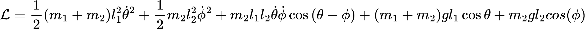

# Pendulo doble
El pendulo doble es un problema interesante, el método mas sencillo para obtener sus ecuaciones de movimiento vienen a partir de su lagrangiano, en este caso el lagrangiano asociado es el siguiente: 



Como es evidente, las ecuaciones diferenciales del lagrangiano no tienen solución analitica, por lo que se deben obtener soluciones con metodos numericos.

## Ejecución
Los pasos para poder ejecutar este archivo estan descritos para linux.

Para poder ejecutar el codigo primero debemos compilar `script.c`

``` 
gcc -o program script.c -lm
``` 

Y para ejecutar se hace

``` 
./program
``` 
Automaticamente el codigo va a pedir los angulos iniciales theta y phi; Despues va a pedir el número de pasos de ejecución, se van a calcular numericamente las soluciones y automaticamente se va ejecutar el script en python